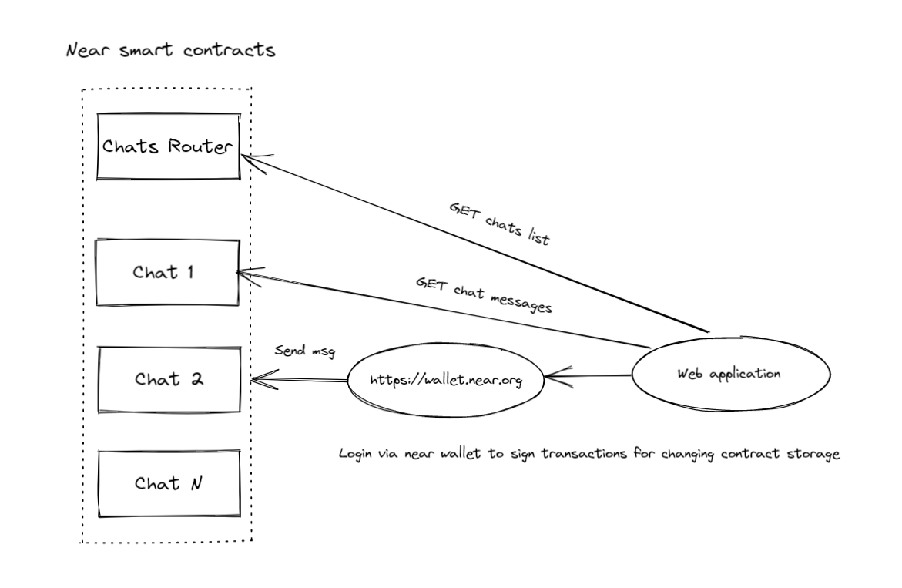

## Near Chat Application

This is [NCD] demo project. No production use intended.

### Diagram


[Excalidraw](https://excalidraw.com/) used to draw diagram.

## Concepts

Chat implementation based on NEAR protocol. It's text chat for whitelisted NEAR accounts and public text channel for the whole world.

These power concepts make dApp oriented for any community or organization.

### Who This Is For

- Developers new to the NEAR Protocol looking for a learning sandbox
- Developers looking for inspiration

## File Structure

This contract is designed to be self-contained and so may be extracted into your own projects and used as a starting point.  If you do decide to use this code, please pay close attention to all top level files including:

- Rust artifacts
  - `Cargo.toml`: Rust project dependencies and configuration
  - `Cargo.lock`: version-locked list of Rust project dependencies

## Build Contracts

You will need [Rust] with `wasm32-unknown-unknown` [target] installed.

Build contracts using script `compile.js`
```
node compile.js
```
or using [cargo]
```
cargo build --target wasm32-unknown-unknown --release
```

## Tests

Run smart contract with [cargo] 
```
cargo test
```

## Run locally
Start up front-end (see [readme](./src/))

[Rust]: https://www.rust-lang.org/
[target]: https://github.com/near/near-sdk-rs#pre-requisites
[cargo]: https://doc.rust-lang.org/book/ch01-03-hello-cargo.html
[NCD]: https://www.near.university/courses/near-certified-developer
[smart contract]: https://docs.near.org/docs/develop/contracts/overview
